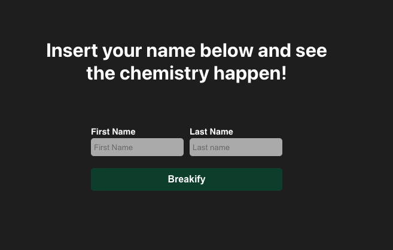
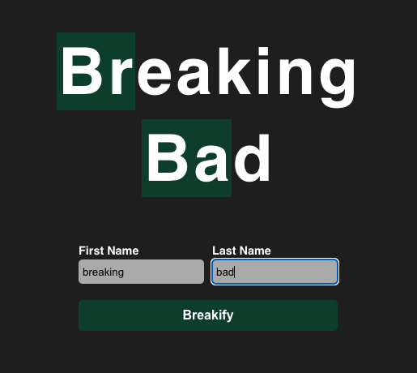

# Breakify project

## Table of Contents

- [Introduction](#introduction)
- [Features](#features)
- [Installation](#installation)
- [Usage](#usage)

## Introduction

This app has the power to 'breakify' information. Have you ever watched the series Breaking Bad? I adored that series, and to this day, I can still hear the show's intro music, even years after I finished watching it. That introduction was truly epic; the play on the chemical elements highlighted in the series' name was a brilliant move. Here in the app, we simulate the title sequence of the series, where you can see the hidden chemical elements within words.

Simply input your first and last name, and witness the chemistry unfold! If any chemical element from the periodic table is in your name, you will see it highlighted.

## Features

- Displays the hidden chemical elements in the information provided by the form using a json database from the periodic table;
- This app utilizes hooks, redux, and redux-thunk to share data between components.
- For styles, utilizes css modules.

## Installation and how to run

- Clone this repository with git clone.
- Install the dependencies with npm install.
- Run the project with npm start.

## Usage

The first screen will direct you to fill in the fields to reveal the chemical elements

As soon as you fill in the fields, if there are chemical elements hidden on the screen, they will be revealed

You can see the app working at: [GitHub Pages](https://sheilatavares.github.io/breakify.github.io/)
